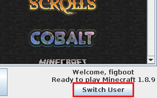
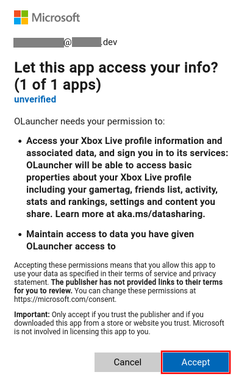
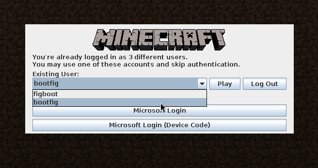

# Manage Microsoft accounts
This page will guide you through logging into and out of a Microsoft account within the launcher.

This page also describes [an alternate method](#log-into-the-launcher-alternate-method) for logging into the launcher, in case you do not have a browser that supports the Microsoft login page.
Users on Windows XP or older may be in this situation.

## Table of contents
1. [Log into the Launcher](#log-into-the-launcher)
2. [Log into the Launcher (alternate method)](#log-into-the-launcher-alternate-method)
3. [Log out of the Launcher](#log-out-of-the-launcher)

## What you will need
To follow the instructions on this page, you will need the following:
- A Microsoft account that owns Minecraft

### A note on Microsoft accounts
If you are not able to log into OLauncher, make sure that your account owns the game by logging in at [minecraft.net](https://www.minecraft.net/en-us/login). Additionally, you must have created a profile by setting your name.

If you are still not able to log in and your Microsoft account's birthday is set to a date less than 18 years in the past, you must be in a [family](https://support.microsoft.com/en-us/account-billing/getting-started-with-microsoft-family-safety-b6280c9d-38d7-82ff-0e4f-a6cb7e659344).

## Log into the Launcher

When opening the launcher for the first time, you will see a login screen. You may also access this login screen by clicking **Switch User**, as seen in [Figure 1](#fig01).

 
**Figure 1**: Switch user button

1. Click **Microsoft Login**.
   
   A browser window should open. If it does not, you may choose **Copy Link** and paste that link into your browser.
2. Follow the instructions on the page to log into your account.
   
   _Note_: This step may involve entering your email address and password. OLauncher does not handle or store your email address or password. You can [revoke OLauncher's access to your account](https://account.microsoft.com/privacy/app-access) at any time.
3. Click **Accept** to the OAuth prompt as seen in [Figure 2](#fig02).

   
    
   **Figure 2**: OLauncher consent form
   
4. Switch to the launcher window.
   
   You should see the launcher news on the screen. You're logged in and ready to play the game!

## Log into the Launcher (alternate method)
This method of logging into the launcher is intended for the cases where the first method does not work. This is generally the case when using OLauncher on an old system, where the installed browser is not modern enough to display the Microsoft login page.

For these steps, you will need a browser capable of displaying the Microsoft login page, usually a mobile phone or separate computer.

As in [Log into the launcher](#log-into-the-launcher), navigate to the login screen.

1. Click **Microsoft Login (Device Code)**.
2. Follow the instructions in the dialog box that appears.
   
   Generally, they will instruct you to visit a Microsoft website and enter a code.
3. Log into the your Microsoft account.
4. Click **Accept** to the OAuth prompt as seen in [Figure 2](#fig02).
   
   Note that you can [revoke OLauncher's access to your account](https://account.microsoft.com/privacy/app-access) at any time.
5. Switch to the launcher window.
   
   After a short time, you should see the launcher news on the screen. You're logged in and ready to play the game!

## Log out of the Launcher
Note that logging out of the launcher does not necessarily revoke OLauncher's access to your Microsoft account (although OLauncher does delete your access token when you log out&mdash;we promise!). You may [revoke OLauncher's access to your account](https://account.microsoft.com/privacy/app-access) through Microsoft.

1. Click **Switch User**, which is located in the lower right, as seen in [Figure 1](#fig01).
2. Select the account you would like to remove. You may use the dropdown as seen in [Figure 3](#fig03).
   
   
    
   **Figure 3**: Account select dropdown
   
3. Click **Log Out**.
