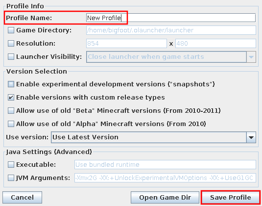
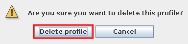

# Manage Launcher Profiles
A profile is a specific configuration of Minecraft. It includes information such as the game version, launch arguments, and game directory.

This page will guide you through creating, editing, and deleting launcher profiles. See [3. Select the game version](03-gamever) for more details on choosing a game version.

## Table of Contents
1. [Create a Profile](#create-a-profile)
2. [Edit a Profile](#edit-a-profile)
3. [Delete a Profile](#delete-a-profile)

## What you will Need
You will need to be [logged into the launcher](01-signin).

## Create a Profile
1. Switch to the **Profile Editor** tab, which can be found at the top of the screen as seen in [Figure 1](#fig01).
   
   
    
   **Figure 1**: Profile editor tab
   

2. Right-click and choose **Add Profile**.
   
   If you would like to clone a profile instead, select a profile, then right-click and choose **Copy Profile**.

3. Type a name for the new profile in the **Profile Name** field.
   
   
    
   **Figure 2**: Profile editor window
   

4. Click **Save Profile**.
   
   The profile should be saved! You may now select and play that profile.

## Edit a Profile
1. Switch to the **Profile Editor** tab as seen in [Figure 1](#fig01).

2. Double-click the profile you wish to edit.
   
   A profile editor window as in [Figure 2](#fig02) will appear. Here, you may rename the profile or make any other modifications you would like.

3. Click **Save Profile**.

## Delete a Profile
_Note_: the profile cannot be recovered once deleted, though the game directory is not cleared. This means that your screenshots, worlds, and mods are preserved.

1. Switch to the **Profile Editor** tab as seen in [Figure 1](#fig01).

2. Right-click the profile you wish to delete and choose **Delete Profile**.

3. Click **Delete profile** on the confirmation dialog that appears as in [Figure 3](#fig03).
   
   
    
   **Figure 3**: Confirmation dialog
   
