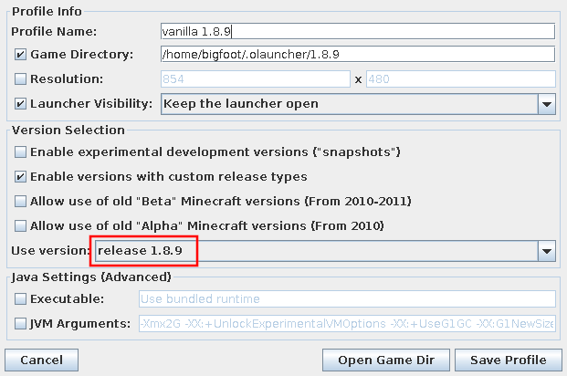

# Change the game version
This page will guide you through tasks related to changing the game version.

## Table of contents
1. [Change a profile's version](#change-a-profiles-version)

## What you will need
Excluding having [logged into the launcher](01-signin), you will need the following things to follow the instructions on this page:

- A launcher profile

### Version management tip
It is best practice to run different versions of the game in different directories, so configuration files, mod directories, and worlds do not conflict. In some versions, if you open a world from another version, the world becomes corrupted.

## Change a profile's version
Before you begin these steps, it is recommended that you [back up](06-installmg#back-up-your-worlds) first.

1. Choose a profile to edit and click **Edit Profile** (see [Figure 1](#fig01)). These options can be found in the lower right corner.
   
   
    
   **Figure 1**: Profile selector
   

   A profile editor window should appear.

   _Note_: You may also follow the steps in [Edit a profile](02-profiles#edit-a-profile).

2. Choose a game version from the dropdown (see [Figure 2](#fig02)).

   
    
   **Figure 1**: Game version
   

   If the version you want to play does not appear, try enabling snapshots, old alpha &amp; beta, or custom versions.

   _Note_: When choosing to use the latest version, modded versions can sometimes be selected. This is a [known issue](https://github.com/olauncher/olauncher/issues/62).
3. Click **Save Profile**.
   
   And you're done! If you launch this profile, the version of the game you selected should be downloaded and run.
