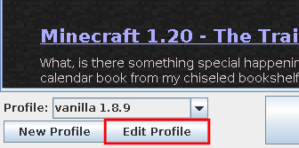

# Change RAM allocation
This page will guide you through changing the amount of RAM allocated to Minecraft.

## Table of contents
- [Allocate more RAM to Minecraft](#allocate-more-ram-to-minecraft)

## What you will need
Excluding having [logged into the launcher](01-signin), you will need the following things to follow the instructions on this page:

- A launcher profile

### A note on JVM arguments
Java Virtual Machine (JVM) arguments control the Java environment. Changing these options may cause the game to fail to start. Proceed with caution.

_Note_: This article will not guide you through the process of tuning your garbage collector for performance. That is beyond the scope of this manual.

## Allocate more RAM to Minecraft
1. Choose a profile to edit and click **Edit Profile** (see [Figure 1](#fig01)). These options can be found in the lower right corner.
   
   
    
   **Figure 1**: Profile selector
   

   A profile editor window should appear.

   _Note_: You may also follow the steps in [Edit a profile](02-profiles#edit-a-profile).

2. Change the heap size under **JVM Arguments**.
   
   The "heap size" is set by arguments starting with "-Xms" and "-Xmx". The former is the "starting" size of the heap, or the RAM usage when the game first launches. The latter is the "maximum" size of the heap. The game cannot use more memory than specified in "-Xmx".

   Follow these arguments with a number and unit like so: "-Xms2G" for 2 gigabytes of RAM, "-Xms512M" for 512 megabytes of starting size.

   It is recommended that you do not set "-Xmx" too high or too low. If the game has too little RAM allocated (usually less than 1 or 2 gigabytes), the game will stutter every few seconds. In-game, you can see this with the F3 menu. If the game has too much RAM allocated (over 8 gigabytes or so depending on your garbage collector), it may perform worse as well.
3. Click **Save Profile**.
