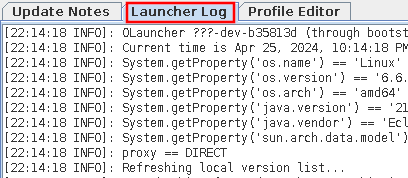
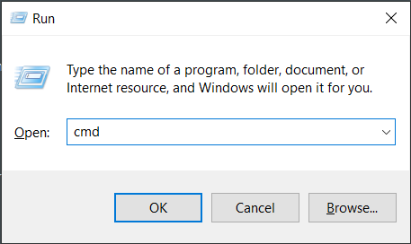

# Collect Launcher Logs
This page will guide you through the process of collecting launcher logs. These will assist developers with helping you troubleshoot the launcher.

## Table of Contents
1. [Capturing Launcher Logs (Windows)](#capturing-launcher-logs-windows)

## Capturing Launcher Logs (Windows)
If the launcher is able to make it past the login screen, the launcher logs are available in the Launcher Log tab (as seen in [Figure 1](#fig01)). Otherwise, follow the steps below.

 
**Figure 1**: Launcher Log tab

1. Open the Command Prompt.
   
   You may use `Win+R` to open the **Run** window and enter `cmd`, then press enter.

   
    
   **Figure 2**: Run window
   

2. Run `java -jar C:\path\to\olauncher.jar`.
   
   As a shortcut, you may enter the full path of the jarfile by dragging it onto the Command Prompt window.

3. Reproduce the issue.

4. Select and copy logs from Command Prompt.
   
   You may use right-click to copy selected text.
   
   The launcher logs will now be on your clipboard. You may paste them into a text file or send them on Discord.

