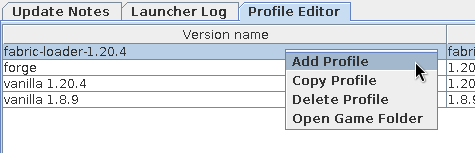
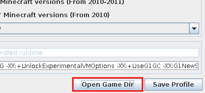
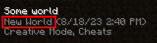

# Manage a Minecraft profile
Once you have been playing in a world for a bit, it is best to make copies of it in case it gets corrupted or mistakenly deleted. Or perhaps you want to access your screenshots or add a resource pack. All of those things (and more) reside in the profile's directory.

## Table of contents
- [Open a profile's directory](#open-a-profiles-directory)
- [Back up your worlds](#back-up-your-worlds)

## Open a profile's directory
1. Open the profile editor.
   
   You may do this using the **Edit Profile** button ([Figure 1](#fig01)) on the bottom banner, or by double clicking a profile on the **Profile Editor** tab ([Figure 2](#fig02)).

   
    
   **Figure 1**: Profile selector
   
   
   
    
   **Figure 2**: Profile editor tab
   

2. Click **Open Game Dir** ([Figure 3](#fig03)).
   
   
    
   **Figure 3**: Open game directory
   
   
   Worlds are in the `saves` directory, screenshots in `screenshots`, and resource packs in `resourcepacks`.

## Back up your worlds
_Note_: Newer versions of the game have an option to back up worlds in-game. This guide is for those versions which do not.

1. [Open the game directory](#open-a-profiles-directory).

2. Enter the `saves` directory and find your world.
   
   The world's folder name is the gray text below the world's "official" name in the world list ([Figure 4](#fig04)).

   
    
   **Figure 4**: World name
   

3. Make a copy of that world folder elsewhere.
   
   You may use a tool of your choice to compress the world file into a `.zip`.

   This backup may be restored by copying or extracting this folder into the `saves` directory.
